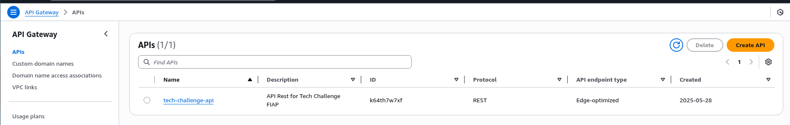
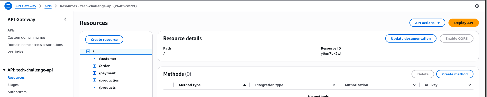
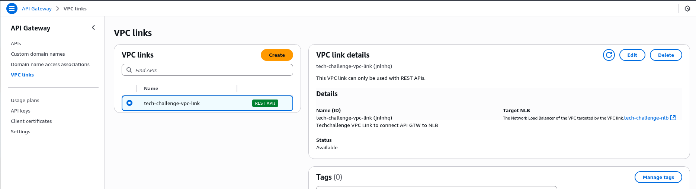
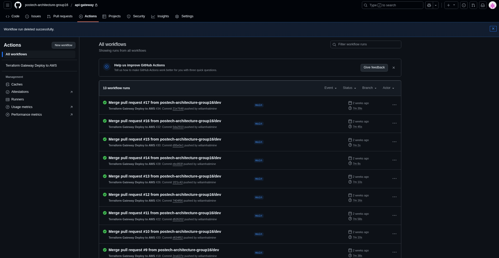

<h3 align="center">API Gateway</h3>

<h3 align="center">Descrição ⚡</h3>

<h3>O AWS API Gateway gerencia e expõe APIs REST, HTTP ou WebSocket, atuando como ponte entre clientes e serviços backend, com controle de segurança, escalabilidade e monitoramento.<h3>

### 👨‍💼 Desenvolvido por

### Api Gateway - Endpoints - VPC link

### Github Actions - Runs

